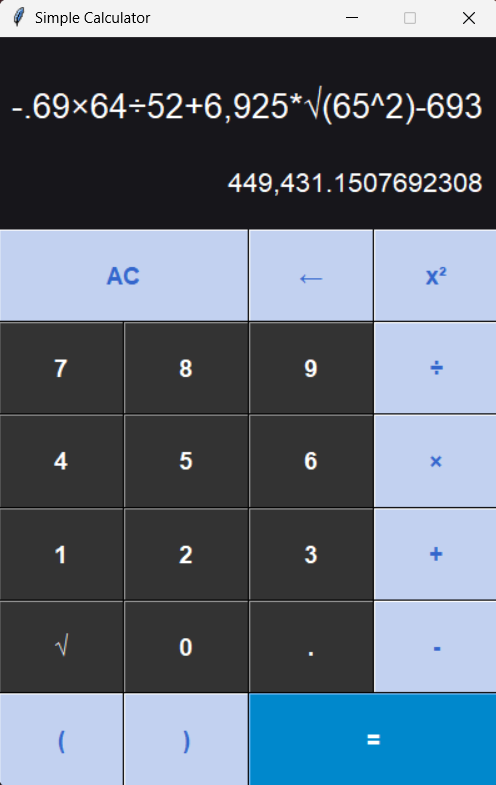

# Simple Calculator

## Overview

The Simple Calculator is a Python-based graphical calculator application developed using the `tkinter` library. This calculator supports basic arithmetic operations and includes advanced features such as exponentiation, square roots, and the ability to handle large numbers with comma separation. It provides a user-friendly interface with buttons for digits, operators, and special functions.

## Features

- **Basic Arithmetic Operations:** Addition, subtraction, multiplication, and division.
- **Advanced Operations:** Exponentiation and square root.
- **Comma Separation:** Automatically formats large numbers with commas for better readability.
- **User-Friendly Interface:** Clean layout with easy-to-use buttons and clear display.

## Screenshots



## Installation

To run the Simple Calculator, you need Python installed on your system. The application uses the `tkinter` library, which is included with standard Python installations. Follow these steps to get started:

1. **Clone the Repository:**
   ```sh
   git clone https://github.com/your-username/calculator.git

2. **Navigate to the Project Directory:**
   ```sh
   cd calculator

3. **Install Dependencies:**
    Create a virtual environment and install the required dependencies using `requirements.txt`. Run the following commands:
   ```sh
   python -m venv venv
source venv/bin/activate  # On Windows use `venv\Scripts\activate`
pip install -r requirements.txt

## Usage

1. **Run the Application:**
    Execute the `calculator.py` file to start the application:
   ```sh
   python calculator.py

2. Interface
- **Display Area:** Shows the current input and the result of the calculation.
- **Buttons:** Includes digits (0-9), operators (+, -, ×, ÷), and special functions (√, x²).

3. Performing Calculations
- **Input Numbers:** Click the number buttons to input numbers.
- **Operators:** Click the operators to perform arithmetic operations.
- **Special Functions:** Use `√` for square root and `x²` for squaring a number.
- **Clear Input:** Use `AC` to clear the current input and `←` to remove the last character.
- **Calculate Result:** Click `=` to evaluate the expression.

## Development

- **Language:** Python 3.12.4
- **Libraries:** tkinter
- **License:** MIT License

## Including Screenshots

### Summary

1. **Create or locate the `images` folder inside your project directory.**
2. **Add your screenshot file to this folder.**
3. **Update your `README.md` to include the screenshot using a relative path.**

This setup will ensure that the screenshot is properly included and displayed in your `README.md` file on GitHub.

## Acknowledgements

- **Python:** For providing the powerful and versatile programming language used to develop this application.
- **tkinter:** For the graphical user interface toolkit used in this project.
- **Inspiration:** Special thanks to online resources and communities for guidance and inspiration during development.

## Additional Information

- **Project Status:** This project is in its initial release. Future updates will include additional features and improvements.
- **Known Issues:** Currently, the calculator does not support complex mathematical functions beyond basic arithmetic and square roots. Future versions may address these limitations.

Feel free to contribute or provide feedback to improve this project!

## Contributing

Contributions are welcome! Please follow these guidelines for contributing:

1. Fork the repository.
2. Create a new branch for your feature or bug fix.
3. Commit your changes.
4. Push to the branch and create a pull request.

## License

This project is licensed under the MIT License. See the [LICENSE](LICENSE) file for details.

## Contact

For any questions or feedback, please contact:

- **Name:** Ch. Varun Kumar
- **Email:** varuncvk13@gmail.com
- **GitHub:** [https://github.com/varunchithiraala](https://github.com/varunchithiraala)